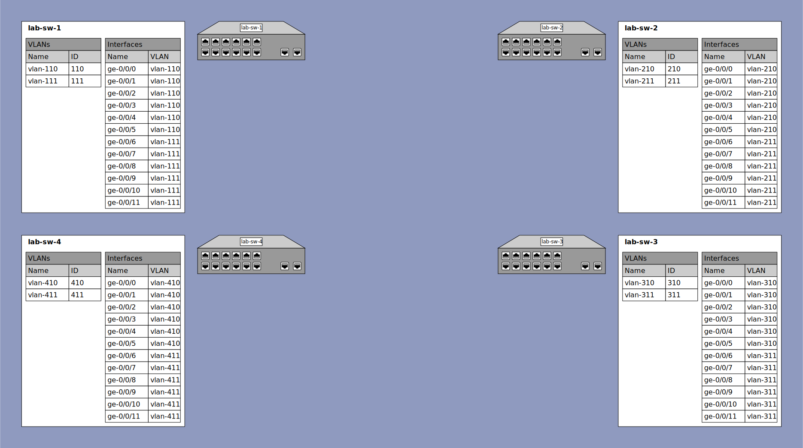

# Lab Exercise 1 - Switching & VLANs

## Outcomes

When completed with this lab, you will have accomplished the following basic switch tasks:

* Configure two VLANs on your switch
* Configure multiple access ports belonging to one or the other VLAN
* Verify the configuration
* Observe successful PING from host to host on the same VLAN
* Observe switching information on the switch
* Observe MAC addresses of devices connected to the switch

## Configuration

### Lab 1 Topology Diagram


<details><summary>lab-sw-1</summary>

### lab-sw-1 Configuration

* Create a VLAN named `vlan-110` with vlan ID `110`
* Create a VLAN named `vlan-111` with vlan ID `111`
* Configure interfaces `ge-0/0/0` through `ge-0/0/5` as access ports on VLAN `vlan-110`
* Configure interfaces `ge-0/0/6` through `ge-0/0/11` as access ports on VLAN `vlan-111`

#### lab-sw-1 Configuration Steps

```
{master:0}
labuser@lab-sw-1> configure
Entering configuration mode

{master:0}[edit]
labuser@lab-sw-1# set vlans vlan-110 vlan-id 110

{master:0}[edit]
labuser@lab-sw-1# set vlans vlan-111 vlan-id 111

{master:0}[edit]
labuser@lab-sw-1# wildcard range set interfaces ge-0/0/[0-11] unit 0 family ethernet-switching interface-mode access

{master:0}[edit]
labuser@lab-sw-1# wildcard range set interfaces ge-0/0/[0-5] unit 0 family ethernet-switching vlan members vlan-110

{master:0}[edit]
labuser@lab-sw-1# wildcard range set interfaces ge-0/0/[6-11] unit 0 family ethernet-switching vlan members vlan-111

{master:0}[edit]
labuser@lab-sw-1# commit check
configuration check succeeds

{master:0}[edit]
labuser@lab-sw-1# commit and-quit
configuration check succeeds
commit complete
Exiting configuration mode

{master:0}
labuser@lab-sw-1>
```

</details>

<details><summary>lab-sw-2</summary>

### lab-sw-2 Configuration

* Create a VLAN named `vlan-210` with vlan ID `210`
* Create a VLAN named `vlan-211` with vlan ID `211`
* Configure interfaces `ge-0/0/0` through `ge-0/0/5` as access ports on VLAN `vlan-210`
* Configure interfaces `ge-0/0/6` through `ge-0/0/11` as access ports on VLAN `vlan-211`

#### lab-sw-2 Configuration Steps
```
{master:0}
labuser@lab-sw-2> configure
Entering configuration mode

{master:0}[edit]
labuser@lab-sw-2# set vlans vlan-210 vlan-id 210

{master:0}[edit]
labuser@lab-sw-2# set vlans vlan-211 vlan-id 211

{master:0}[edit]
labuser@lab-sw-2# wildcard range set interfaces ge-0/0/[0-11] unit 0 family ethernet-switching interface-mode access

{master:0}[edit]
labuser@lab-sw-2# wildcard range set interfaces ge-0/0/[0-5] unit 0 family ethernet-switching vlan members vlan-210

{master:0}[edit]
labuser@lab-sw-2# wildcard range set interfaces ge-0/0/[6-11] unit 0 family ethernet-switching vlan members vlan-211

{master:0}[edit]
labuser@lab-sw-2# commit check
configuration check succeeds

{master:0}[edit]
labuser@lab-sw-2# commit and-quit
configuration check succeeds
commit complete
Exiting configuration mode

{master:0}
labuser@lab-sw-2>
```

</details>

<details><summary>lab-sw-3</summary>

### lab-sw-3 Configuration

* Create a VLAN named `vlan-310` with vlan ID `310`
* Create a VLAN named `vlan-311` with vlan ID `311`
* Configure interfaces `ge-0/0/0` through `ge-0/0/5` as access ports on VLAN `vlan-310`
* Configure interfaces `ge-0/0/6` through `ge-0/0/11` as access ports on VLAN `vlan-311`

#### lab-sw-3 Configuration Steps
```
{master:0}
labuser@lab-sw-3> configure
Entering configuration mode

{master:0}[edit]
labuser@lab-sw-3# set vlans vlan-310 vlan-id 310

{master:0}[edit]
labuser@lab-sw-3# set vlans vlan-311 vlan-id 311

{master:0}[edit]
labuser@lab-sw-3# wildcard range set interfaces ge-0/0/[0-11] unit 0 family ethernet-switching interface-mode access

{master:0}[edit]
labuser@lab-sw-3# wildcard range set interfaces ge-0/0/[0-5] unit 0 family ethernet-switching vlan members vlan-310

{master:0}[edit]
labuser@lab-sw-3# wildcard range set interfaces ge-0/0/[6-11] unit 0 family ethernet-switching vlan members vlan-311

{master:0}[edit]
labuser@lab-sw-3# commit check
configuration check succeeds

{master:0}[edit]
labuser@lab-sw-3# commit and-quit
configuration check succeeds
commit complete
Exiting configuration mode

{master:0}
labuser@lab-sw-3>
```

</details>

<details><summary>lab-sw-4</summary>

### lab-sw-4 Configuration

* Create a VLAN named `vlan-410` with vlan ID `410`
* Create a VLAN named `vlan-411` with vlan ID `411`
* Configure interfaces `ge-0/0/0` through `ge-0/0/5` as access ports on VLAN `vlan-410`
* Configure interfaces `ge-0/0/6` through `ge-0/0/11` as access ports on VLAN `vlan-411`

#### lab-sw-4 Configuration Steps
```
{master:0}
labuser@lab-sw-4> configure
Entering configuration mode

{master:0}[edit]
labuser@lab-sw-4# set vlans vlan-410 vlan-id 410

{master:0}[edit]
labuser@lab-sw-4# set vlans vlan-411 vlan-id 411

{master:0}[edit]
labuser@lab-sw-4# wildcard range set interfaces ge-0/0/[0-11] unit 0 family ethernet-switching interface-mode access

{master:0}[edit]
labuser@lab-sw-4# wildcard range set interfaces ge-0/0/[0-5] unit 0 family ethernet-switching vlan members vlan-410

{master:0}[edit]
labuser@lab-sw-4# wildcard range set interfaces ge-0/0/[6-11] unit 0 family ethernet-switching vlan members vlan-411

{master:0}[edit]
labuser@lab-sw-4# commit check
configuration check succeeds

{master:0}[edit]
labuser@lab-sw-4# commit and-quit
configuration check succeeds
commit complete
Exiting configuration mode

{master:0}
labuser@lab-sw-4>
```

</details>

## Verification

* Check that the VLANs exist on the switch
* Check that the VLANs are assigned to the expected interfaces
* Check the MAC address table of the switch

<details><summary>lab-sw-1</summary>

### lab-sw-1 Verification

```
{master:0}
labuser@lab-sw-1> show vlans

Routing instance        VLAN name             Tag          Interfaces
default-switch          default               1

default-switch          vlan-110              110
                                                           ge-0/0/0.0
                                                           ge-0/0/1.0
                                                           ge-0/0/2.0
                                                           ge-0/0/3.0
                                                           ge-0/0/4.0
                                                           ge-0/0/5.0
default-switch          vlan-111              111
                                                           ge-0/0/6.0
                                                           ge-0/0/7.0
                                                           ge-0/0/8.0
                                                           ge-0/0/9.0
                                                           ge-0/0/10.0
                                                           ge-0/0/11.0

{master:0}
labuser@lab-sw-1> show ethernet-switching interface | no-more
Logical Interface flags (DL - disable learning, AD - packet action drop,
                         LH - MAC limit hit, DN - interface down,
                         MMAS - Mac-move action shutdown,  AS - Autostate-exclude enabled,
                         SCTL - shutdown by Storm-control, SL - Secure Learning,
                         MI - MAC+IP limit hit, LP - Loop Protect Down,
                         MLAS - Mac limit action shutdown, CISO - Shutdown due to core isolation)

Logical         Vlan                   TAG   MAC    MAC+IP STP         Logical          Tagging
interface       members                      limit  limit  state       interface flags
Routing Instance Name : default-switch
ge-0/0/0.0                                   65536  0                  DN               untagged
                vlan-110               110   65536  0      Discarding                   untagged
Routing Instance Name : default-switch
ge-0/0/1.0                                   65536  0                  DN               untagged
                vlan-110               110   65536  0      Discarding                   untagged
Routing Instance Name : default-switch
ge-0/0/2.0                                   65536  0                  DN               untagged
                vlan-110               110   65536  0      Discarding                   untagged
Routing Instance Name : default-switch
ge-0/0/3.0                                   65536  0                  DN               untagged
                vlan-110               110   65536  0      Discarding                   untagged
Routing Instance Name : default-switch
ge-0/0/4.0                                   65536  0                  DN               untagged
                vlan-110               110   65536  0      Discarding                   untagged
Routing Instance Name : default-switch
ge-0/0/5.0                                   65536  0                  DN               untagged
                vlan-110               110   65536  0      Discarding                   untagged
Routing Instance Name : default-switch
ge-0/0/6.0                                   65536  0                  DN               untagged
                vlan-111               111   65536  0      Discarding                   untagged
Routing Instance Name : default-switch
ge-0/0/7.0                                   65536  0                  DN               untagged
                vlan-111               111   65536  0      Discarding                   untagged
Routing Instance Name : default-switch
ge-0/0/8.0                                   65536  0                  DN               untagged
                vlan-111               111   65536  0      Discarding                   untagged
Routing Instance Name : default-switch
ge-0/0/9.0                                   65536  0                  DN               untagged
                vlan-111               111   65536  0      Discarding                   untagged
Routing Instance Name : default-switch
ge-0/0/10.0                                  65536  0                  DN               untagged
                vlan-111               111   65536  0      Discarding                   untagged
Routing Instance Name : default-switch
ge-0/0/11.0                                  65536  0                  DN               untagged
                vlan-111               111   65536  0      Discarding                   untagged

{master:0}
labuser@lab-sw-1> show ethernet-switching table

{master:0}
labuser@lab-sw-1>
```

</details>
<details><summary>lab-sw-2</summary>

### lab-sw-2 Verification

```
{master:0}
labuser@lab-sw-2> show vlans

Routing instance        VLAN name             Tag          Interfaces
default-switch          default               1

default-switch          vlan-210              210
                                                           ge-0/0/0.0
                                                           ge-0/0/1.0
                                                           ge-0/0/2.0
                                                           ge-0/0/3.0
                                                           ge-0/0/4.0
                                                           ge-0/0/5.0
default-switch          vlan-211              211
                                                           ge-0/0/6.0
                                                           ge-0/0/7.0
                                                           ge-0/0/8.0
                                                           ge-0/0/9.0
                                                           ge-0/0/10.0
                                                           ge-0/0/11.0

{master:0}
labuser@lab-sw-2> show ethernet-switching interface | no-more
Logical Interface flags (DL - disable learning, AD - packet action drop,
                         LH - MAC limit hit, DN - interface down,
                         MMAS - Mac-move action shutdown,  AS - Autostate-exclude enabled,
                         SCTL - shutdown by Storm-control, SL - Secure Learning,
                         MI - MAC+IP limit hit, LP - Loop Protect Down,
                         MLAS - Mac limit action shutdown, CISO - Shutdown due to core isolation)

Logical         Vlan                   TAG   MAC    MAC+IP STP         Logical          Tagging
interface       members                      limit  limit  state       interface flags
Routing Instance Name : default-switch
ge-0/0/0.0                                   65536  0                  DN               untagged
                vlan-210               210   65536  0      Discarding                   untagged
Routing Instance Name : default-switch
ge-0/0/1.0                                   65536  0                  DN               untagged
                vlan-210               210   65536  0      Discarding                   untagged
Routing Instance Name : default-switch
ge-0/0/2.0                                   65536  0                  DN               untagged
                vlan-210               210   65536  0      Discarding                   untagged
Routing Instance Name : default-switch
ge-0/0/3.0                                   65536  0                  DN               untagged
                vlan-210               210   65536  0      Discarding                   untagged
Routing Instance Name : default-switch
ge-0/0/4.0                                   65536  0                  DN               untagged
                vlan-210               210   65536  0      Discarding                   untagged
Routing Instance Name : default-switch
ge-0/0/5.0                                   65536  0                  DN               untagged
                vlan-210               210   65536  0      Discarding                   untagged
Routing Instance Name : default-switch
ge-0/0/6.0                                   65536  0                  DN               untagged
                vlan-211               211   65536  0      Discarding                   untagged
Routing Instance Name : default-switch
ge-0/0/7.0                                   65536  0                  DN               untagged
                vlan-211               211   65536  0      Discarding                   untagged
Routing Instance Name : default-switch
ge-0/0/8.0                                   65536  0                  DN               untagged
                vlan-211               211   65536  0      Discarding                   untagged
Routing Instance Name : default-switch
ge-0/0/9.0                                   65536  0                  DN               untagged
                vlan-211               211   65536  0      Discarding                   untagged
Routing Instance Name : default-switch
ge-0/0/10.0                                  65536  0                  DN               untagged
                vlan-211               211   65536  0      Discarding                   untagged
Routing Instance Name : default-switch
ge-0/0/11.0                                  65536  0                  DN               untagged
                vlan-211               211   65536  0      Discarding                   untagged

{master:0}
labuser@lab-sw-2> show ethernet-switching table

{master:0}
labuser@lab-sw-2>
```

</details>
<details><summary>lab-sw-3</summary>

### lab-sw-3 Verification

```
{master:0}
labuser@lab-sw-3> show vlans

Routing instance        VLAN name             Tag          Interfaces
default-switch          default               1

default-switch          vlan-310              310
                                                           ge-0/0/0.0
                                                           ge-0/0/1.0
                                                           ge-0/0/2.0
                                                           ge-0/0/3.0
                                                           ge-0/0/4.0
                                                           ge-0/0/5.0
default-switch          vlan-311              311
                                                           ge-0/0/6.0
                                                           ge-0/0/7.0
                                                           ge-0/0/8.0
                                                           ge-0/0/9.0
                                                           ge-0/0/10.0
                                                           ge-0/0/11.0

{master:0}
labuser@lab-sw-3> show ethernet-switching interface | no-more
Logical Interface flags (DL - disable learning, AD - packet action drop,
                         LH - MAC limit hit, DN - interface down,
                         MMAS - Mac-move action shutdown,  AS - Autostate-exclude enabled,
                         SCTL - shutdown by Storm-control, SL - Secure Learning,
                         MI - MAC+IP limit hit, LP - Loop Protect Down,
                         MLAS - Mac limit action shutdown, CISO - Shutdown due to core isolation)

Logical         Vlan                   TAG   MAC    MAC+IP STP         Logical          Tagging
interface       members                      limit  limit  state       interface flags
Routing Instance Name : default-switch
ge-0/0/0.0                                   65536  0                  DN               untagged
                vlan-310               310   65536  0      Discarding                   untagged
Routing Instance Name : default-switch
ge-0/0/1.0                                   65536  0                  DN               untagged
                vlan-310               310   65536  0      Discarding                   untagged
Routing Instance Name : default-switch
ge-0/0/2.0                                   65536  0                  DN               untagged
                vlan-310               310   65536  0      Discarding                   untagged
Routing Instance Name : default-switch
ge-0/0/3.0                                   65536  0                  DN               untagged
                vlan-310               310   65536  0      Discarding                   untagged
Routing Instance Name : default-switch
ge-0/0/4.0                                   65536  0                  DN               untagged
                vlan-310               310   65536  0      Discarding                   untagged
Routing Instance Name : default-switch
ge-0/0/5.0                                   65536  0                  DN               untagged
                vlan-310               310   65536  0      Discarding                   untagged
Routing Instance Name : default-switch
ge-0/0/6.0                                   65536  0                  DN               untagged
                vlan-311               311   65536  0      Discarding                   untagged
Routing Instance Name : default-switch
ge-0/0/7.0                                   65536  0                  DN               untagged
                vlan-311               311   65536  0      Discarding                   untagged
Routing Instance Name : default-switch
ge-0/0/8.0                                   65536  0                  DN               untagged
                vlan-311               311   65536  0      Discarding                   untagged
Routing Instance Name : default-switch
ge-0/0/9.0                                   65536  0                  DN               untagged
                vlan-311               311   65536  0      Discarding                   untagged
Routing Instance Name : default-switch
ge-0/0/10.0                                  65536  0                  DN               untagged
                vlan-311               311   65536  0      Discarding                   untagged
Routing Instance Name : default-switch
ge-0/0/11.0                                  65536  0                  DN               untagged
                vlan-311               311   65536  0      Discarding                   untagged

{master:0}
labuser@lab-sw-3> show ethernet-switching table

{master:0}
labuser@lab-sw-3>
```

</details>
<details><summary>lab-sw-4</summary>

### lab-sw-4 Verification

```
{master:0}
labuser@lab-sw-4> show vlans

Routing instance        VLAN name             Tag          Interfaces
default-switch          default               1

default-switch          vlan-410              410
                                                           ge-0/0/0.0
                                                           ge-0/0/1.0
                                                           ge-0/0/2.0
                                                           ge-0/0/3.0
                                                           ge-0/0/4.0
                                                           ge-0/0/5.0
default-switch          vlan-411              411
                                                           ge-0/0/6.0
                                                           ge-0/0/7.0
                                                           ge-0/0/8.0
                                                           ge-0/0/9.0
                                                           ge-0/0/10.0
                                                           ge-0/0/11.0

{master:0}
labuser@lab-sw-4> show ethernet-switching interface | no-more
Logical Interface flags (DL - disable learning, AD - packet action drop,
                         LH - MAC limit hit, DN - interface down,
                         MMAS - Mac-move action shutdown,  AS - Autostate-exclude enabled,
                         SCTL - shutdown by Storm-control, SL - Secure Learning,
                         MI - MAC+IP limit hit, LP - Loop Protect Down,
                         MLAS - Mac limit action shutdown, CISO - Shutdown due to core isolation)

Logical         Vlan                   TAG   MAC    MAC+IP STP         Logical          Tagging
interface       members                      limit  limit  state       interface flags
Routing Instance Name : default-switch
ge-0/0/0.0                                   65536  0                  DN               untagged
                vlan-410               410   65536  0      Discarding                   untagged
Routing Instance Name : default-switch
ge-0/0/1.0                                   65536  0                  DN               untagged
                vlan-410               410   65536  0      Discarding                   untagged
Routing Instance Name : default-switch
ge-0/0/2.0                                   65536  0                  DN               untagged
                vlan-410               410   65536  0      Discarding                   untagged
Routing Instance Name : default-switch
ge-0/0/3.0                                   65536  0                  DN               untagged
                vlan-410               410   65536  0      Discarding                   untagged
Routing Instance Name : default-switch
ge-0/0/4.0                                   65536  0                  DN               untagged
                vlan-410               410   65536  0      Discarding                   untagged
Routing Instance Name : default-switch
ge-0/0/5.0                                   65536  0                  DN               untagged
                vlan-410               410   65536  0      Discarding                   untagged
Routing Instance Name : default-switch
ge-0/0/6.0                                   65536  0                  DN               untagged
                vlan-411               411   65536  0      Discarding                   untagged
Routing Instance Name : default-switch
ge-0/0/7.0                                   65536  0                  DN               untagged
                vlan-411               411   65536  0      Discarding                   untagged
Routing Instance Name : default-switch
ge-0/0/8.0                                   65536  0                  DN               untagged
                vlan-411               411   65536  0      Discarding                   untagged
Routing Instance Name : default-switch
ge-0/0/9.0                                   65536  0                  DN               untagged
                vlan-411               411   65536  0      Discarding                   untagged
Routing Instance Name : default-switch
ge-0/0/10.0                                  65536  0                  DN               untagged
                vlan-411               411   65536  0      Discarding                   untagged
Routing Instance Name : default-switch
ge-0/0/11.0                                  65536  0                  DN               untagged
                vlan-411               411   65536  0      Discarding                   untagged

{master:0}
labuser@lab-sw-4> show ethernet-switching table

{master:0}
labuser@lab-sw-4>
```

</details>

### Additional Exploration

Connect two devices to your switch on ports `ge-0/0/0` and `ge-0/0/1` and configure them with static IP addresses within the same subnet.


| Switch | VLAN | Switch Port | Device IP Address | Device Netmask | Device Gateway |
| --- | --- | --- | --- | --- | --- |
| lab-sw-1 | vlan-110 | ge-0/0/0 | 10.1.10.5 | 255.255.255.0 | 10.1.10.1 |
| lab-sw-1 | vlan-110 | ge-0/0/1 | 10.1.10.6 | 255.255.255.0 | 10.1.10.1 |
| lab-sw-2 | vlan-110 | ge-0/0/0 | 10.2.10.5 | 255.255.255.0 | 10.2.10.1 |
| lab-sw-2 | vlan-110 | ge-0/0/1 | 10.2.10.6 | 255.255.255.0 | 10.2.10.1 |
| lab-sw-3 | vlan-110 | ge-0/0/0 | 10.3.10.5 | 255.255.255.0 | 10.3.10.1 |
| lab-sw-3 | vlan-110 | ge-0/0/1 | 10.3.10.6 | 255.255.255.0 | 10.3.10.1 |
| lab-sw-4 | vlan-110 | ge-0/0/0 | 10.4.10.5 | 255.255.255.0 | 10.4.10.1 |
| lab-sw-4 | vlan-110 | ge-0/0/1 | 10.4.10.6 | 255.255.255.0 | 10.4.10.1 |

#### Questions

* Can you communicate between the devices?
* What does the output of `show vlans`, `show ethernet-switching interface`, and `show ethernet-switching table` look like now?
* Reconnect one of the two devices to port `ge-0/0/6` and repeat steps 2 and 3. What happens now?

## Finishing Up

Once we are satisfied that the configuration is good, let's save a copy that we can load later if we need to.

```
{master:0}
labuser@lab-sw-1> configure
Entering configuration mode

{master:0}[edit]
labuser@lab-sw-1# save lab1-final.conf
Wrote 292 lines of configuration to 'lab1-final.conf'

{master:0}[edit]
labuser@lab-sw-1# exit
Exiting configuration mode

{master:0}
labuser@lab-sw-1> exit

WARNING!! UNAUTHORIZED ACCESS TO THIS SYSTEM IS A VIOLATION OF THE FEDERAL ELECTRONIC COMMUNICATIONS PRIVACY ACT OF 1986, AND MAY RESULT IN FINES OF 250,000 AND/OR IMPRISONMENT UNDER (TITLE 18, USC ).

FreeBSD/arm64 (lab-sw-1) (ttyu0)

login:
```
