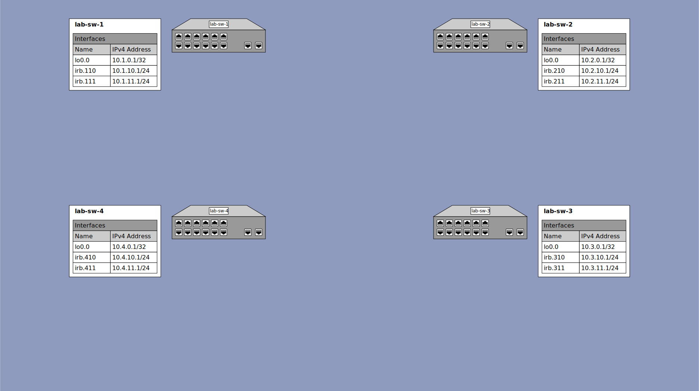

# Lab Exercise 2 - Inter-VLAN Routing

## Outcomes

When completed with this lab, you will have accomplished the following basic routing tasks:
* Configure a loopback interface on the switch
* Configure layer 3 interfaces for two VLANs configured on the switch
* Verify the configuration
* Observe successful PING and TRACEROUTE through the switch from one subnet to the other
* Observe successful PING all IP addresses configured on switch from either subnet
* Observe routing information on the switch
* Observe ARP information of devices connected to the switch

## Configuration

### Lab 2 Topology Diagram


<details><summary>lab-sw-1</summary>

#### lab-sw-1 Configuration

* Configure layer 3 interface `lo0.0` with IP address `10.1.0.1/32`
* Configure layer 3 interface `irb.110` with IP address `10.1.10.1/24`
* Configure layer 3 interface `irb.111` with IP address `10.1.11.1/24`
* Add the layer 3 interface `irb.110` to the existing VLAN named `vlan-110` with vlan ID `110`
* Add the layer 3 interface `irb.111` to the existing VLAN named `vlan-111` with vlan ID `111`

#### lab-sw-1 Configuration Steps

```
{master:0}
labuser@lab-sw-1> configure
Entering configuration mode

{master:0}[edit]
labuser@lab-sw-1# set interfaces lo0.0 family inet address 10.1.0.1/32

{master:0}[edit]
labuser@lab-sw-1# set interfaces irb.110 family inet address 10.1.10.1/24

{master:0}[edit]
labuser@lab-sw-1# set interfaces irb.111 family inet address 10.1.11.1/24

{master:0}[edit]
labuser@lab-sw-1# set vlans vlan-110 l3-interface irb.110

{master:0}[edit]
labuser@lab-sw-1# set vlans vlan-111 l3-interface irb.111

{master:0}[edit]
labuser@lab-sw-1# commit check
configuration check succeeds

{master:0}[edit]
labuser@lab-sw-1# commit and-quit
configuration check succeeds
commit complete
Exiting configuration mode

{master:0}
labuser@lab-sw-1>
```

</details>

<details><summary>lab-sw-2</summary>

#### lab-sw-2 Configuration

* Configure layer 3 interface `lo0.0` with IP address `10.2.0.1/32`
* Configure layer 3 interface `irb.210` with IP address `10.2.10.1/24`
* Configure layer 3 interface `irb.211` with IP address `10.2.11.1/24`
* Add the layer 3 interface `irb.210` to the existing VLAN named `vlan-210` with vlan ID `210`
* Add the layer 3 interface `irb.211` to the existing VLAN named `vlan-211` with vlan ID `211`

#### lab-sw-2 Configuration Steps

```
{master:0}
labuser@lab-sw-2> configure
Entering configuration mode

{master:0}[edit]
labuser@lab-sw-2# set interfaces lo0.0 family inet address 10.2.0.1/32

{master:0}[edit]
labuser@lab-sw-2# set interfaces irb.210 family inet address 10.2.10.1/24

{master:0}[edit]
labuser@lab-sw-2# set interfaces irb.211 family inet address 10.2.11.1/24

{master:0}[edit]
labuser@lab-sw-2# set vlans vlan-210 l3-interface irb.210

{master:0}[edit]
labuser@lab-sw-2# set vlans vlan-211 l3-interface irb.211

{master:0}[edit]
labuser@lab-sw-2# commit check
configuration check succeeds

{master:0}[edit]
labuser@lab-sw-2# commit and-quit
configuration check succeeds
commit complete
Exiting configuration mode

{master:0}
labuser@lab-sw-2>
```

</details>

<details><summary>lab-sw-3</summary>

#### lab-sw-3 Configuration

* Configure layer 3 interface `lo0.0` with IP address `10.3.0.1/32`
* Configure layer 3 interface `irb.310` with IP address `10.3.10.1/24`
* Configure layer 3 interface `irb.311` with IP address `10.3.11.1/24`
* Add the layer 3 interface `irb.310` to the existing VLAN named `vlan-310` with vlan ID `310`
* Add the layer 3 interface `irb.311` to the existing VLAN named `vlan-311` with vlan ID `311`

#### lab-sw-3 Configuration Steps

```
{master:0}
labuser@lab-sw-3> configure
Entering configuration mode

{master:0}[edit]
labuser@lab-sw-3# set interfaces lo0.0 family inet address 10.3.0.1/32

{master:0}[edit]
labuser@lab-sw-3# set interfaces irb.310 family inet address 10.3.10.1/24

{master:0}[edit]
labuser@lab-sw-3# set interfaces irb.311 family inet address 10.3.11.1/24

{master:0}[edit]
labuser@lab-sw-3# set vlans vlan-310 l3-interface irb.310

{master:0}[edit]
labuser@lab-sw-3# set vlans vlan-311 l3-interface irb.311

{master:0}[edit]
labuser@lab-sw-3# commit check
configuration check succeeds

{master:0}[edit]
labuser@lab-sw-3# commit and-quit
configuration check succeeds
commit complete
Exiting configuration mode

{master:0}
labuser@lab-sw-3>
```

</details>

<details><summary>lab-sw-4</summary>

#### lab-sw-4 Configuration

* Configure layer 3 interface `lo0.0` with IP address `10.4.0.1/32`
* Configure layer 3 interface `irb.410` with IP address `10.4.10.1/24`
* Configure layer 3 interface `irb.411` with IP address `10.4.11.1/24`
* Add the layer 3 interface `irb.410` to the existing VLAN named `vlan-410` with vlan ID `410`
* Add the layer 3 interface `irb.411` to the existing VLAN named `vlan-411` with vlan ID `411`

#### lab-sw-4 Configuration Steps

```
{master:0}
labuser@lab-sw-4> configure
Entering configuration mode

{master:0}[edit]
labuser@lab-sw-4# set interfaces lo0.0 family inet address 10.4.0.1/32

{master:0}[edit]
labuser@lab-sw-4# set interfaces irb.410 family inet address 10.4.10.1/24

{master:0}[edit]
labuser@lab-sw-4# set interfaces irb.411 family inet address 10.4.11.1/24

{master:0}[edit]
labuser@lab-sw-4# set vlans vlan-410 l3-interface irb.410

{master:0}[edit]
labuser@lab-sw-4# set vlans vlan-411 l3-interface irb.411

{master:0}[edit]
labuser@lab-sw-4# commit check
configuration check succeeds

{master:0}[edit]
labuser@lab-sw-4# commit and-quit
configuration check succeeds
commit complete
Exiting configuration mode

{master:0}
labuser@lab-sw-4>
```

</details>

## Verification

* Check that the new layer 3 interfaces are either up up (administratively up, and link up) or up down (administratively up, and link down)
* Check that the routing table has entries for the IP addresses and subnets
* Check the ARP table of the switch

<details><summary>lab-sw-1</summary>

### lab-sw-1 Verification

```
{master:0}
labuser@lab-sw-1> show interfaces terse | match "Interface|inet"
Interface               Admin Link Proto    Local                 Remote
pfe-0/0/0.16383         up    up   inet
                                   inet6
pfh-0/0/0.16383         up    up   inet
pfh-0/0/0.16384         up    up   inet
bme0.0                  up    up   inet     128.0.0.1/2
irb.110                 up    down inet     10.1.10.1/24
irb.111                 up    down inet     10.1.11.1/24
jsrv.1                  up    up   inet     128.0.0.127/2
lo0.0                   up    up   inet     10.1.0.1            --> 0/0
lo0.16385               up    up   inet

{master:0}
labuser@lab-sw-1> show route terse

inet.0: 3 destinations, 3 routes (3 active, 0 holddown, 0 hidden)
Limit/Threshold: 32768/32768 destinations
+ = Active Route, - = Last Active, * = Both

A V Destination        P Prf   Metric 1   Metric 2  Next hop        AS path
* ? 10.1.0.1/32        D   0                       >lo0.0
* ? 10.1.10.1/32       L   0                        Reject
* ? 10.1.11.1/32       L   0                        Reject

{master:0}
labuser@lab-sw-1> show arp

{master:0}
labuser@lab-sw-1>
```

</details>

<details><summary>lab-sw-2</summary>

### lab-sw-2 Verification

```
{master:0}
labuser@lab-sw-2> show interfaces terse | match "Interface|inet"
Interface               Admin Link Proto    Local                 Remote
pfe-0/0/0.16383         up    up   inet
                                   inet6
pfh-0/0/0.16383         up    up   inet
pfh-0/0/0.16384         up    up   inet
bme0.0                  up    up   inet     128.0.0.1/2
irb.210                 up    down inet     10.2.10.1/24
irb.211                 up    down inet     10.2.11.1/24
jsrv.1                  up    up   inet     128.0.0.127/2
lo0.0                   up    up   inet     10.2.0.1            --> 0/0
lo0.16385               up    up   inet

{master:0}
labuser@lab-sw-2> show route terse

inet.0: 3 destinations, 3 routes (3 active, 0 holddown, 0 hidden)
Limit/Threshold: 32768/32768 destinations
+ = Active Route, - = Last Active, * = Both

A V Destination        P Prf   Metric 1   Metric 2  Next hop        AS path
* ? 10.2.0.1/32        D   0                       >lo0.0
* ? 10.2.10.1/32       L   0                        Reject
* ? 10.2.11.1/32       L   0                        Reject

{master:0}
labuser@lab-sw-2> show arp

{master:0}
labuser@lab-sw-2>
```

</details>

<details><summary>lab-sw-3</summary>

### lab-sw-3 Verification

```
{master:0}
labuser@lab-sw-3> show interfaces terse | match "Interface|inet"
Interface               Admin Link Proto    Local                 Remote
pfe-0/0/0.16383         up    up   inet
                                   inet6
pfh-0/0/0.16383         up    up   inet
pfh-0/0/0.16384         up    up   inet
bme0.0                  up    up   inet     128.0.0.1/2
irb.310                 up    down inet     10.3.10.1/24
irb.310                 up    down inet     10.3.11.1/24
jsrv.1                  up    up   inet     128.0.0.127/2
lo0.0                   up    up   inet     10.3.0.1            --> 0/0
lo0.16385               up    up   inet

{master:0}
labuser@lab-sw-3> show route terse

inet.0: 3 destinations, 3 routes (3 active, 0 holddown, 0 hidden)
Limit/Threshold: 32768/32768 destinations
+ = Active Route, - = Last Active, * = Both

A V Destination        P Prf   Metric 1   Metric 2  Next hop        AS path
* ? 10.3.0.1/32        D   0                       >lo0.0
* ? 10.3.10.1/32       L   0                        Reject
* ? 10.3.11.1/32       L   0                        Reject

{master:0}
labuser@lab-sw-3> show arp

{master:0}
labuser@lab-sw-3>
```

</details>

<details><summary>lab-sw-4</summary>

### lab-sw-4 Verification

```
{master:0}
labuser@lab-sw-4> show interfaces terse | match "Interface|inet"
Interface               Admin Link Proto    Local                 Remote
pfe-0/0/0.16383         up    up   inet
                                   inet6
pfh-0/0/0.16383         up    up   inet
pfh-0/0/0.16384         up    up   inet
bme0.0                  up    up   inet     128.0.0.1/2
irb.410                 up    down inet     10.4.10.1/24
irb.411                 up    down inet     10.4.11.1/24
jsrv.1                  up    up   inet     128.0.0.127/2
lo0.0                   up    up   inet     10.4.0.1            --> 0/0
lo0.16385               up    up   inet

{master:0}
labuser@lab-sw-4> show route terse

inet.0: 3 destinations, 3 routes (3 active, 0 holddown, 0 hidden)
Limit/Threshold: 32768/32768 destinations
+ = Active Route, - = Last Active, * = Both

A V Destination        P Prf   Metric 1   Metric 2  Next hop        AS path
* ? 10.4.0.1/32        D   0                       >lo0.0
* ? 10.4.10.1/32       L   0                        Reject
* ? 10.4.11.1/32       L   0                        Reject

{master:0}
labuser@lab-sw-4> show arp

{master:0}
labuser@lab-sw-4>
```

</details>

### Additional Exploration

Connect two devices to your switch, one on each VLAN, and configure them with static IP addresses within the appropriate subnet assigned to that VLAN.

| Switch | VLAN | Switch Port | Device IP Address | Device Netmask | Device Gateway |
| --- | --- | --- | --- | --- | --- |
| lab-sw-1 | vlan-110 | ge-0/0/0 - ge-0/0/5 | 10.1.10.5 | 255.255.255.0 | 10.1.10.1 |
| lab-sw-1 | vlan-111 | ge-0/0/6 - ge-0/0/11 | 10.1.11.5 | 255.255.255.0 | 10.1.11.1 |
| lab-sw-2 | vlan-210 | ge-0/0/0 - ge-0/0/5 | 10.2.10.5 | 255.255.255.0 | 10.2.10.1 |
| lab-sw-2 | vlan-211 | ge-0/0/6 - ge-0/0/11 | 10.2.11.5 | 255.255.255.0 | 10.2.11.1 |
| lab-sw-3 | vlan-310 | ge-0/0/0 - ge-0/0/5 | 10.3.10.5 | 255.255.255.0 | 10.3.10.1 |
| lab-sw-3 | vlan-311 | ge-0/0/6 - ge-0/0/11 | 10.3.11.5 | 255.255.255.0 | 10.3.11.1 |
| lab-sw-4 | vlan-410 | ge-0/0/0 - ge-0/0/5 | 10.4.10.5 | 255.255.255.0 | 10.4.10.1 |
| lab-sw-4 | vlan-411 | ge-0/0/6 - ge-0/0/11 | 10.4.11.5 | 255.255.255.0 | 10.4.11.1 |

#### Questions

* Can you ping from device to device? What about traceroute or tracepath?
* Can you ping the IP addresses you configured on the switch? What do the device ARP tables look like?
* What does the output of show interfaces terse| match inet, show arp, and show route look like now?

## Finishing Up

Once we are satisfied that the configuration is good, let's save a copy that we can load later if we need to.

```
{master:0}
labuser@lab-sw-1> configure
Entering configuration mode

{master:0}[edit]
labuser@lab-sw-1# save lab2-final.conf
Wrote 292 lines of configuration to 'lab2-final.conf'

{master:0}[edit]
labuser@lab-sw-1# exit
Exiting configuration mode

{master:0}
labuser@lab-sw-1> exit

WARNING!!  UNAUTHORIZED ACCESS TO THIS SYSTEM IS A VIOLATION OF THE FEDERAL ELECTRONIC COMMUNICATIONS PRIVACY ACT  OF 1986, AND MAY RESULT IN FINES OF 250,000 AND/OR IMPRISONMENT UNDER (TITLE 18, USC ).

FreeBSD/arm64 (lab-sw-1) (ttyu0)

login:
```
