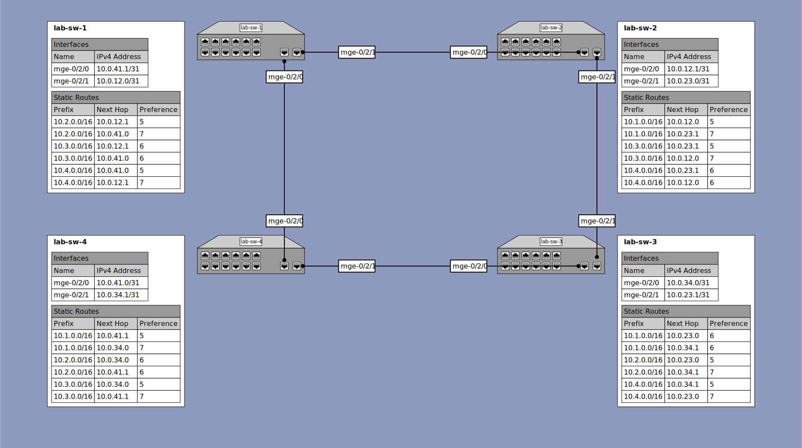

# Lab Exercise 3 - Static Routing

## Outcomes

When completed with this lab, you will have accomplished the following basic routing tasks:
* Configure and link-up layer 3 interfaces between the switches in the lab
* Configure static routes to allow bidirectional communication between customer networks configured on all switches
* Verify the configuration
  * Observe LLDP neighbor information to confirm physical network topology
  * Observe routing information on the switch
  * Observe ARP information of devices connected to the switch
  * PING and TRACEROUTE through the switches from any host connected to one switch to any host connected to the other switch in the pair
  * PING all active IP addresses configured on the switches from from any host connected to either switch
* Additional Exploration
  * Observe behavior of a single link failure
  * Perform additional configuration to allow bidirectional communication between all networks configured on all switches

## Configuration

### Lab 3 Topology Diagram


<details><summary>lab-sw-1</summary>

#### lab-sw-1 Configuration

* Configure interface `mge-0/2/0.0` with IP address `10.0.41.1/31`
* Configure interface `mge-0/2/1.0` with IP address `10.0.12.0/31`
* Configure static route to destination network `10.2.0.0/16` with qualified-next-hop gateways `10.0.41.0` and `10.0.12.1`
* Configure static route to destination network `10.3.0.0/16` with qualified-next-hop gateways `10.0.41.0` and `10.0.12.1`
* Configure static route to destination network `10.4.0.0/16` with qualified-next-hop gateways `10.0.41.0` and `10.0.12.1`
* Configured each qualified-next-hop with an appropriate preference value based on the number of routers between the local switch and the destination network (for the given path):
  * `preference 5` for a destination 1 router away
  * `preference 6` for a destination 2 routers away
  * `preference 7` for a destination 3 routers away

#### lab-sw-1 Configuration Steps

```
{master:0}
labuser@lab-sw-1> configure
Entering configuration mode

{master:0}[edit]
labuser@lab-sw-1# set interfaces mge-0/2/0 unit 0 family inet address 10.0.41.1/31

{master:0}[edit]
labuser@lab-sw-1# set interfaces mge-0/2/1 unit 0 family inet address 10.0.12.0/31

{master:0}[edit]
labuser@lab-sw-1# set routing-options static route 10.2.0.0/16 qualified-next-hop 10.0.12.1 preference 5

{master:0}[edit]
labuser@lab-sw-1# set routing-options static route 10.2.0.0/16 qualified-next-hop 10.0.41.0 preference 7

{master:0}[edit]
labuser@lab-sw-1# set routing-options static route 10.3.0.0/16 qualified-next-hop 10.0.12.1 preference 6

{master:0}[edit]
labuser@lab-sw-1# set routing-options static route 10.3.0.0/16 qualified-next-hop 10.0.41.0 preference 6

{master:0}[edit]
labuser@lab-sw-1# set routing-options static route 10.4.0.0/16 qualified-next-hop 10.0.12.1 preference 7

{master:0}[edit]
labuser@lab-sw-1# set routing-options static route 10.4.0.0/16 qualified-next-hop 10.0.41.0 preference 5

{master:0}[edit]
labuser@lab-sw-1# commit check
configuration check succeeds

{master:0}[edit]
labuser@lab-sw-1# commit and-quit
configuration check succeeds
commit complete
Exiting configuration mode

{master:0}
labuser@lab-sw-1>
```

</details>

<details><summary>lab-sw-2</summary>

#### lab-sw-2 Configuration

* Configure interface `mge-0/2/0.0` with IP address `10.0.12.1/31`
* Configure interface `mge-0/2/1.0` with IP address `10.0.23.0/31`
* Configure static route to destination network `10.1.0.0/16` with qualified-next-hop gateways `10.0.12.0` and `10.0.23.1`
* Configure static route to destination network `10.3.0.0/16` with qualified-next-hop gateways `10.0.12.0` and `10.0.23.1`
* Configure static route to destination network `10.4.0.0/16` with qualified-next-hop gateways `10.0.12.0` and `10.0.23.1`
* Configured each qualified-next-hop with an appropriate preference value based on the number of routers between the local switch and the destination network (for the given path):
  * `preference 5` for a destination 1 router away
  * `preference 6` for a destination 2 routers away
  * `preference 7` for a destination 3 routers away

#### lab-sw-2 Configuration Steps

```
{master:0}
labuser@lab-sw-2> configure
Entering configuration mode

{master:0}[edit]
labuser@lab-sw-2# set interfaces mge-0/2/0 unit 0 family inet address 10.0.12.1/31

{master:0}[edit]
labuser@lab-sw-2# set interfaces mge-0/2/1 unit 0 family inet address 10.0.23.0/31

{master:0}[edit]
labuser@lab-sw-2# set routing-options static route 10.1.0.0/16 qualified-next-hop 10.0.12.0 preference 5

{master:0}[edit]
labuser@lab-sw-2# set routing-options static route 10.1.0.0/16 qualified-next-hop 10.0.23.1 preference 7

{master:0}[edit]
labuser@lab-sw-2# set routing-options static route 10.3.0.0/16 qualified-next-hop 10.0.12.0 preference 7

{master:0}[edit]
labuser@lab-sw-2# set routing-options static route 10.3.0.0/16 qualified-next-hop 10.0.23.1 preference 5

{master:0}[edit]
labuser@lab-sw-2# set routing-options static route 10.4.0.0/16 qualified-next-hop 10.0.12.0 preference 6

{master:0}[edit]
labuser@lab-sw-2# set routing-options static route 10.4.0.0/16 qualified-next-hop 10.0.23.1 preference 6

{master:0}[edit]
labuser@lab-sw-2# commit check
configuration check succeeds

{master:0}[edit]
labuser@lab-sw-2# commit and-quit
configuration check succeeds
commit complete
Exiting configuration mode

{master:0}
labuser@lab-sw-2>
```

</details>

<details><summary>lab-sw-3</summary>

#### lab-sw-3 Configuration

* Configure interface `mge-0/2/0.0` with IP address `10.0.34.0/31`
* Configure interface `mge-0/2/1.0` with IP address `10.0.23.1/31`
* Configure static route to destination network `10.1.0.0/16` with qualified-next-hop gateways `10.0.23.0` and `10.0.34.1`
* Configure static route to destination network `10.2.0.0/16` with qualified-next-hop gateways `10.0.23.0` and `10.0.34.1`
* Configure static route to destination network `10.4.0.0/16` with qualified-next-hop gateways `10.0.23.0` and `10.0.34.1`
* Configured each qualified-next-hop with an appropriate preference value based on the number of routers between the local switch and the destination network (for the given path):
  * `preference 5` for a destination 1 router away
  * `preference 6` for a destination 2 routers away
  * `preference 7` for a destination 3 routers away

#### lab-sw-3 Configuration Steps

```
{master:0}
labuser@lab-sw-3> configure
Entering configuration mode

{master:0}[edit]
labuser@lab-sw-3# set interfaces mge-0/2/0 unit 0 family inet address 10.0.34.0/31

{master:0}[edit]
labuser@lab-sw-3# set interfaces mge-0/2/1 unit 0 family inet address 10.0.23.1/31

{master:0}[edit]
labuser@lab-sw-3# set routing-options static route 10.1.0.0/16 qualified-next-hop 10.0.23.0 preference 6

{master:0}[edit]
labuser@lab-sw-3# set routing-options static route 10.1.0.0/16 qualified-next-hop 10.0.34.1 preference 6

{master:0}[edit]
labuser@lab-sw-3# set routing-options static route 10.2.0.0/16 qualified-next-hop 10.0.23.0 preference 5

{master:0}[edit]
labuser@lab-sw-3# set routing-options static route 10.2.0.0/16 qualified-next-hop 10.0.34.1 preference 7

{master:0}[edit]
labuser@lab-sw-3# set routing-options static route 10.4.0.0/16 qualified-next-hop 10.0.23.0 preference 7

{master:0}[edit]
labuser@lab-sw-3# set routing-options static route 10.4.0.0/16 qualified-next-hop 10.0.34.1 preference 5

{master:0}[edit]
labuser@lab-sw-3# commit check
configuration check succeeds

{master:0}[edit]
labuser@lab-sw-3# commit and-quit
configuration check succeeds
commit complete
Exiting configuration mode

{master:0}
labuser@lab-sw-3>
```

</details>

<details><summary>lab-sw-4</summary>

#### lab-sw-4 Configuration

* Configure interface `mge-0/2/0.0` with IP address `10.0.41.0/31`
* Configure interface `mge-0/2/1.0` with IP address `10.0.34.1/31`
* Configure static route to destination network `10.1.0.0/16` with qualified-next-hop gateways `10.0.34.0` and `10.0.41.1`
* Configure static route to destination network `10.2.0.0/16` with qualified-next-hop gateways `10.0.34.0` and `10.0.41.1`
* Configure static route to destination network `10.3.0.0/16` with qualified-next-hop gateways `10.0.34.0` and `10.0.41.1`
* Configured each qualified-next-hop with an appropriate preference value based on the number of routers between the local switch and the destination network (for the given path):
  * `preference 5` for a destination 1 router away
  * `preference 6` for a destination 2 routers away
  * `preference 7` for a destination 3 routers away

#### lab-sw-4 Configuration Steps

```
{master:0}
labuser@lab-sw-4> configure
Entering configuration mode

{master:0}[edit]
labuser@lab-sw-4# set interfaces mge-0/2/0 unit 0 family inet address 10.0.41.0/31

{master:0}[edit]
labuser@lab-sw-4# set interfaces mge-0/2/1 unit 0 family inet address 10.0.34.1/31

{master:0}[edit]
labuser@lab-sw-4# set routing-options static route 10.1.0.0/16 qualified-next-hop 10.0.34.0 preference 7

{master:0}[edit]
labuser@lab-sw-4# set routing-options static route 10.1.0.0/16 qualified-next-hop 10.0.41.1 preference 5

{master:0}[edit]
labuser@lab-sw-4# set routing-options static route 10.2.0.0/16 qualified-next-hop 10.0.34.0 preference 6

{master:0}[edit]
labuser@lab-sw-4# set routing-options static route 10.2.0.0/16 qualified-next-hop 10.0.41.1 preference 6

{master:0}[edit]
labuser@lab-sw-4# set routing-options static route 10.3.0.0/16 qualified-next-hop 10.0.34.0 preference 5

{master:0}[edit]
labuser@lab-sw-4# set routing-options static route 10.3.0.0/16 qualified-next-hop 10.0.41.1 preference 7

{master:0}[edit]
labuser@lab-sw-4# commit check
configuration check succeeds

{master:0}[edit]
labuser@lab-sw-4# commit and-quit
configuration check succeeds
commit complete
Exiting configuration mode

{master:0}
labuser@lab-sw-4>
```

</details>

## Verification

* Check that the new layer 3 interface is up up (administratively up, and link up)
* Check that the expected remote switch is connected to your switch
* Check that the routing table has entries for the IP addresses and subnets


<details><summary>lab-sw-1</summary>

### lab-sw-1 Verification

```
{master:0}
root@lab-sw-1> show interfaces terse mge-0/2/*
Interface               Admin Link Proto    Local                 Remote
mge-0/2/0               up    up
mge-0/2/0.0             up    up   inet     10.0.41.1/31
mge-0/2/1               up    up
mge-0/2/1.0             up    up   inet     10.0.12.0/31

{master:0}
root@lab-sw-1> show lldp neighbors
Local Interface    Parent Interface    Chassis Id                               Port info          System Name
mge-0/2/0          -                   e4:5e:cc:51:3d:a0                        mge-0/2/0           lab-sw-4
mge-0/2/1          -                   e4:5e:cc:52:af:a0                        mge-0/2/0           lab-sw-2

{master:0}
root@lab-sw-1> show route protocol static terse

inet.0: 10 destinations, 12 routes (10 active, 0 holddown, 0 hidden)
Limit/Threshold: 32768/32768 destinations
+ = Active Route, - = Last Active, * = Both

A V Destination        P Prf   Metric 1   Metric 2  Next hop        AS path
* ? 10.2.0.0/16        S   5                       >10.0.12.1
  ?                    S   7                       >10.0.41.0
* ? 10.3.0.0/16        S   6                        10.0.41.0
                                                   >10.0.12.1
* ? 10.4.0.0/16        S   5                       >10.0.41.0
  ?                    S   7                       >10.0.12.1

{master:0}
root@lab-sw-1>
```

</details>

<details><summary>lab-sw-2</summary>

### lab-sw-2 Verification

```
{master:0}
root@lab-sw-2> show interfaces terse mge-0/2/*
Interface               Admin Link Proto    Local                 Remote
mge-0/2/0               up    up
mge-0/2/0.0             up    up   inet     10.0.12.1/31
mge-0/2/1               up    up
mge-0/2/1.0             up    up   inet     10.0.23.0/31

{master:0}
root@lab-sw-2> show lldp neighbors
Local Interface    Parent Interface    Chassis Id                               Port info          System Name
mge-0/2/0          -                   e4:5e:cc:51:3d:a0                        mge-0/2/1           lab-sw-1
mge-0/2/1          -                   e4:5e:cc:52:af:a0                        mge-0/2/1           lab-sw-3

{master:0}
root@lab-sw-2> show route protocol static terse

inet.0: 10 destinations, 12 routes (10 active, 0 holddown, 0 hidden)
Limit/Threshold: 32768/32768 destinations
+ = Active Route, - = Last Active, * = Both

A V Destination        P Prf   Metric 1   Metric 2  Next hop        AS path
* ? 10.1.0.0/16        S   5                       >10.0.12.0
  ?                    S   7                       >10.0.23.1
* ? 10.3.0.0/16        S   5                       >10.0.23.1
  ?                    S   7                       >10.0.12.0
* ? 10.4.0.0/16        S   6                        10.0.12.0
                                                   >10.0.23.1

{master:0}
root@lab-sw-2>
```

</details>

<details><summary>lab-sw-3</summary>

### lab-sw-3 Verification

```
{master:0}
root@lab-sw-3> show interfaces terse mge-0/2/*
Interface               Admin Link Proto    Local                 Remote
mge-0/2/0               up    up
mge-0/2/0.0             up    up   inet     10.0.34.0/31
mge-0/2/1               up    up
mge-0/2/1.0             up    up   inet     10.0.23.1/31

{master:0}
root@lab-sw-3> show lldp neighbors
Local Interface    Parent Interface    Chassis Id                               Port info          System Name
mge-0/2/0          -                   e4:5e:cc:51:3d:a0                        mge-0/2/1           lab-sw-4
mge-0/2/1          -                   e4:5e:cc:52:af:a0                        mge-0/2/1           lab-sw-2

{master:0}
root@lab-sw-3> show route protocol static terse

inet.0: 10 destinations, 12 routes (10 active, 0 holddown, 0 hidden)
Limit/Threshold: 32768/32768 destinations
+ = Active Route, - = Last Active, * = Both

A V Destination        P Prf   Metric 1   Metric 2  Next hop        AS path
* ? 10.1.0.0/16        S   6                        10.0.34.1
                                                   >10.0.23.0
* ? 10.2.0.0/16        S   5                       >10.0.23.0
  ?                    S   7                       >10.0.34.1
* ? 10.4.0.0/16        S   5                       >10.0.34.1
  ?                    S   7                       >10.0.23.0

{master:0}
root@lab-sw-3>
```

</details>

<details><summary>lab-sw-4</summary>

### lab-sw-4 Verification

```
{master:0}
root@lab-sw-4> show interfaces terse mge-0/2/*
Interface               Admin Link Proto    Local                 Remote
mge-0/2/0               up    up
mge-0/2/0.0             up    up   inet     10.0.41.0/31
mge-0/2/1               up    up
mge-0/2/1.0             up    up   inet     10.0.34.1/31

{master:0}
root@lab-sw-4> show lldp neighbors
Local Interface    Parent Interface    Chassis Id                               Port info          System Name
mge-0/2/0          -                   e4:5e:cc:51:3d:a0                        mge-0/2/0           lab-sw-1
mge-0/2/1          -                   e4:5e:cc:52:af:a0                        mge-0/2/0           lab-sw-3

{master:0}
root@lab-sw-4> show route protocol static terse

inet.0: 10 destinations, 12 routes (10 active, 0 holddown, 0 hidden)
Limit/Threshold: 32768/32768 destinations
+ = Active Route, - = Last Active, * = Both

A V Destination        P Prf   Metric 1   Metric 2  Next hop        AS path
* ? 10.1.0.0/16        S   5                       >10.0.41.1
  ?                    S   7                       >10.0.34.0
* ? 10.2.0.0/16        S   6                        10.0.41.1
                                                   >10.0.34.0
* ? 10.3.0.0/16        S   5                       >10.0.34.0
  ?                    S   7                       >10.0.41.1

{master:0}
root@lab-sw-4>
```

</details>

### Additional Exploration

* Connect a device to your switch, configure the device with the subnet and gateway information and verify connection to your local gateway and the local switch loopback address.

#### Questions

* Can you ping the gateway for the subnet your device is connected to? Can you ping all interfaces on the switch (including the loopback address?
* Can you ping from device to device? What about traceroute or tracepath?
* What do the device and switch ARP tables look like?
* What does the output of show interfaces terse| match inet, show arp, and show route look like now?
* Can you ping the loopback or any interfaces of any of the other switches? Compare with the from device vs from the switch?
* Are there any addresses configured anywhere on the network that you are unable to reach with PING? Why? Can we fix it?

## Finishing Up

Once we are satisfied that the configuration is good, let's save a copy that we can load later if we need to.

```
{master:0}
labuser@lab-sw-1> configure
Entering configuration mode

{master:0}[edit]
labuser@lab-sw-1# save lab3-final.conf
Wrote 292 lines of configuration to 'lab3-final.conf'

{master:0}[edit]
labuser@lab-sw-1# exit
Exiting configuration mode

{master:0}
labuser@lab-sw-1> exit

WARNING!! UNAUTHORIZED ACCESS TO THIS SYSTEM IS A VIOLATION OF THE FEDERAL ELECTRONIC COMMUNICATIONS PRIVACY ACT OF 1986, AND MAY RESULT IN FINES OF 250,000 AND/OR IMPRISONMENT UNDER (TITLE 18, USC ).

FreeBSD/arm64 (lab-sw-1) (ttyu0)

login:
```
