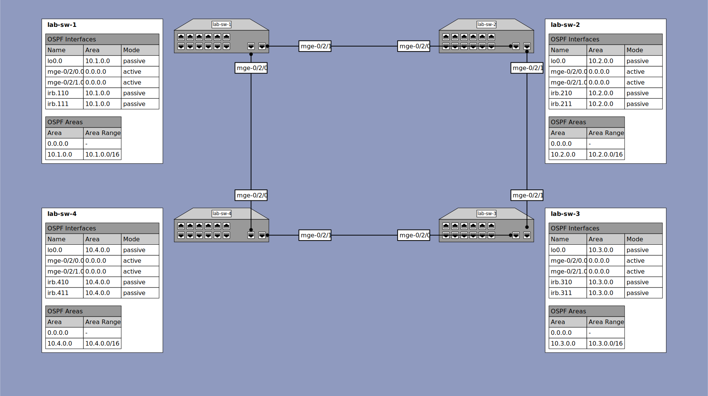

# Lab Exercise 4 - Dynamic Routing with OSPF

## Outcomes

When completed with this lab, you will have accomplished the following basic routing tasks:
* Replace existing static route configuration with a dynamic routing protocol (OSPF)
* Configure the OSPF protocol on all switches to allow bidirectional communication between customer networks configured on all switches
* Verify the configuration
  * Observe routing information on the switch
  * Observe ARP information of devices connected to the switch
  * PING and TRACEROUTE through the switches from any host connected to one switch to any host connected to the other switch in the pair
  * PING all active IP addresses configured on the switches from from any host connected to either switch
* Additional Exploration
  * Observe behavior of a single link failure
  * Perform additional configuration to enable faster network convergence if possible

## Configuration

### Lab 4 Topology Diagram


<details><summary>lab-sw-1</summary>

#### lab-sw-1 Configuration

* Remove the static route configurations added in the previous exercices, preserving the interface configurations.
* Configure ospf area `0.0.0.0` and add interfaces `mge-0/2/0.0` and `mge-0/2/1.0` as active interfaces within the area.
* Configure ospf area `10.1.0.0` and add interfaces `lo0.0`, `irb.110` and `irb.111` as passive interfaces within the area.
* Configure route summarization within the `10.1.0.0` area for the network `10.1.0.0/16`

#### lab-sw-1 Configuration Steps

Note: The license warning can be ignored when issuing the `commit` commands. In a production environment, we would need to purchase a license in order to use the ospf dynamic routing protocol on this platform. The system will complain, but remain functional which is acceptible in a lab environment.
```
{master:0}
labuser@lab-sw-1> configure
Entering configuration mode

{master:0}[edit]
labuser@lab-sw-1# delete routing-options static

{master:0}[edit]
labuser@lab-sw-1# set protocols ospf area 0.0.0.0 interface mge-0/2/0.0

{master:0}[edit]
labuser@lab-sw-1# set protocols ospf area 0.0.0.0 interface mge-0/2/1.0

{master:0}[edit]
labuser@lab-sw-1# set protocols ospf area 10.1.0.0 interface lo0.0

{master:0}[edit]
labuser@lab-sw-1# set protocols ospf area 10.1.0.0 interface irb.110

{master:0}[edit]
labuser@lab-sw-1# set protocols ospf area 10.1.0.0 interface irb.111

{master:0}[edit]
labuser@lab-sw-1# set protocols ospf area 10.1.0.0 area-range 10.1.0.0/16

{master:0}[edit]
labuser@lab-sw-1# commit check
[edit protocols]
  'ospf'
    warning: One or more members of the VC require 'OSPF' license
configuration check succeeds

{master:0}[edit]
labuser@lab-sw-1# commit and-quit
[edit protocols]
  'ospf'
    warning: One or more members of the VC require 'OSPF' license
configuration check succeeds
commit complete
Exiting configuration mode

{master:0}
labuser@lab-sw-1>
```

</details>

<details><summary>lab-sw-2</summary>

#### lab-sw-2 Configuration

* Remove the static route configurations added in the previous exercices, preserving the interface configurations.
* Configure ospf area `0.0.0.0` and add interfaces `mge-0/2/0.0` and `mge-0/2/1.0` as active interfaces within the area.
* Configure ospf area `10.2.0.0` and add interfaces `lo0.0`, `irb.210` and `irb.211` as passive interfaces within the area.
* Configure route summarization within the `10.2.0.0` area for the network `10.2.0.0/16`

#### lab-sw-2 Configuration Steps

Note: The license warning can be ignored when issuing the `commit` commands. In a production environment, we would need to purchase a license in order to use the ospf dynamic routing protocol on this platform. The system will complain, but remain functional which is acceptible in a lab environment.
```
{master:0}
labuser@lab-sw-2> configure
Entering configuration mode

{master:0}[edit]
labuser@lab-sw-1# delete routing-options static

{master:0}[edit]
labuser@lab-sw-2# set protocols ospf area 0.0.0.0 interface mge-0/2/0.0

{master:0}[edit]
labuser@lab-sw-2# set protocols ospf area 0.0.0.0 interface mge-0/2/1.0

{master:0}[edit]
labuser@lab-sw-2# set protocols ospf area 10.2.0.0 interface lo0.0

{master:0}[edit]
labuser@lab-sw-2# set protocols ospf area 10.2.0.0 interface irb.210

{master:0}[edit]
labuser@lab-sw-2# set protocols ospf area 10.2.0.0 interface irb.211

{master:0}[edit]
labuser@lab-sw-2# set protocols ospf area 10.2.0.0 area-range 10.2.0.0/16

{master:0}[edit]
labuser@lab-sw-2# commit check
[edit protocols]
  'ospf'
    warning: One or more members of the VC require 'OSPF' license
configuration check succeeds

{master:0}[edit]
labuser@lab-sw-2# commit and-quit
[edit protocols]
  'ospf'
    warning: One or more members of the VC require 'OSPF' license
configuration check succeeds
commit complete
Exiting configuration mode

{master:0}
labuser@lab-sw-2>
```

</details>

<details><summary>lab-sw-3</summary>

#### lab-sw-3 Configuration

* Remove the static route configurations added in the previous exercices, preserving the interface configurations.
* Configure ospf area `0.0.0.0` and add interfaces `mge-0/2/0.0` and `mge-0/2/1.0` as active interfaces within the area.
* Configure ospf area `10.3.0.0` and add interfaces `lo0.0`, `irb.310` and `irb.311` as passive interfaces within the area.
* Configure route summarization within the `10.3.0.0` area for the network `10.3.0.0/16`

#### lab-sw-3 Configuration Steps

Note: The license warning can be ignored when issuing the `commit` commands. In a production environment, we would need to purchase a license in order to use the ospf dynamic routing protocol on this platform. The system will complain, but remain functional which is acceptible in a lab environment.
```
{master:0}
labuser@lab-sw-3> configure
Entering configuration mode

{master:0}[edit]
labuser@lab-sw-1# delete routing-options static

{master:0}[edit]
labuser@lab-sw-3# set protocols ospf area 0.0.0.0 interface mge-0/2/0.0

{master:0}[edit]
labuser@lab-sw-3# set protocols ospf area 0.0.0.0 interface mge-0/2/1.0

{master:0}[edit]
labuser@lab-sw-3# set protocols ospf area 10.3.0.0 interface lo0.0

{master:0}[edit]
labuser@lab-sw-3# set protocols ospf area 10.3.0.0 interface irb.310

{master:0}[edit]
labuser@lab-sw-3# set protocols ospf area 10.3.0.0 interface irb.311

{master:0}[edit]
labuser@lab-sw-3# set protocols ospf area 10.3.0.0 area-range 10.3.0.0/16

{master:0}[edit]
labuser@lab-sw-3# commit check
[edit protocols]
  'ospf'
    warning: One or more members of the VC require 'OSPF' license
configuration check succeeds

{master:0}[edit]
labuser@lab-sw-3# commit and-quit
[edit protocols]
  'ospf'
    warning: One or more members of the VC require 'OSPF' license
configuration check succeeds
commit complete
Exiting configuration mode

{master:0}
labuser@lab-sw-3>
```

</details>

<details><summary>lab-sw-4</summary>

#### lab-sw-4 Configuration

* Remove the static route configurations added in the previous exercices, preserving the interface configurations.
* Configure ospf area `0.0.0.0` and add interfaces `mge-0/2/0.0` and `mge-0/2/1.0` as active interfaces within the area.
* Configure ospf area `10.4.0.0` and add interfaces `lo0.0`, `irb.410` and `irb.411` as passive interfaces within the area.
* Configure route summarization within the `10.4.0.0` area for the network `10.4.0.0/16`

#### lab-sw-4 Configuration Steps

Note: The license warning can be ignored when issuing the `commit` commands. In a production environment, we would need to purchase a license in order to use the ospf dynamic routing protocol on this platform. The system will complain, but remain functional which is acceptible in a lab environment.
```
{master:0}
labuser@lab-sw-4> configure
Entering configuration mode

{master:0}[edit]
labuser@lab-sw-1# delete routing-options static

{master:0}[edit]
labuser@lab-sw-4# set protocols ospf area 0.0.0.0 interface mge-0/2/0.0

{master:0}[edit]
labuser@lab-sw-4# set protocols ospf area 0.0.0.0 interface mge-0/2/1.0

{master:0}[edit]
labuser@lab-sw-4# set protocols ospf area 10.4.0.0 interface lo0.0

{master:0}[edit]
labuser@lab-sw-4# set protocols ospf area 10.4.0.0 interface irb.410

{master:0}[edit]
labuser@lab-sw-4# set protocols ospf area 10.4.0.0 interface irb.411

{master:0}[edit]
labuser@lab-sw-4# set protocols ospf area 10.4.0.0 area-range 10.4.0.0/16

{master:0}[edit]
labuser@lab-sw-4# commit check
[edit protocols]
  'ospf'
    warning: One or more members of the VC require 'OSPF' license
configuration check succeeds

{master:0}[edit]
labuser@lab-sw-4# commit and-quit
[edit protocols]
  'ospf'
    warning: One or more members of the VC require 'OSPF' license
configuration check succeeds
commit complete
Exiting configuration mode

{master:0}
labuser@lab-sw-4>
```

</details>

## Verification

* Check the OSPF protocol status
* Check for OSPF neighbors
* Check that the routing table has entries for the IP addresses and subnets

Note: Your output will differ from what is shown in the verification steps. The output here will be updated after we do this lab exercise together.

<details><summary>lab-sw-1</summary>

### lab-sw-1 Verification

```
{master:0}
root@lab-sw-1> show ospf overview

Warning: License key missing; One or more members of the VC require 'OSPF' license

Instance: master
  Router ID: 10.1.0.1
  Route table index: 0
  Area border router
  LSA refresh time: 50 minutes
  Post Convergence Backup: Disabled
  Area: 0.0.0.0
    Stub type: Not Stub
    Authentication Type: None
    Area border routers: 0, AS boundary routers: 0
    Neighbors
      Up (in full state): 0
  Area: 10.1.0.0
    Stub type: Not Stub
    Authentication Type: None
    Area border routers: 0, AS boundary routers: 0
    Neighbors
      Up (in full state): 0
  Topology: default (ID 0)
    Prefix export count: 0
    Full SPF runs: 3
    SPF delay: 0.200000 sec, SPF holddown: 5 sec, SPF rapid runs: 3
    Backup SPF: Not Needed

{master:0}[edit]
root@lab-sw-1# run show ospf interface

Warning: License key missing; One or more members of the VC require 'OSPF' license

Interface           State   Area            DR ID           BDR ID          Nbrs
mge-0/1/0.0         DR      0.0.0.0         10.1.0.1        0.0.0.0            0
mge-0/1/1.0         DR      0.0.0.0         10.1.0.1        0.0.0.0            0
irb.110             Down    10.1.0.0        0.0.0.0         0.0.0.0            0
irb.111             Down    10.1.0.0        0.0.0.0         0.0.0.0            0
lo0.0               DR      10.1.0.0        10.1.0.1        0.0.0.0            0

{master:0}
root@lab-sw-1> show ospf neighbors
~~~ output omitted ~~~

{master:0}
root@lab-sw-1> show route protocol ospf terse
~~~ output omitted ~~~

{master:0}
root@lab-sw-1>
```

</details>

<details><summary>lab-sw-2</summary>

### lab-sw-2 Verification

```
{master:0}
root@lab-sw-2> show ospf overview

Warning: License key missing; One or more members of the VC require 'OSPF' license

Instance: master
  Router ID: 10.2.0.1
  Route table index: 0
  Area border router
  LSA refresh time: 50 minutes
  Post Convergence Backup: Disabled
  Area: 0.0.0.0
    Stub type: Not Stub
    Authentication Type: None
    Area border routers: 0, AS boundary routers: 0
    Neighbors
      Up (in full state): 0
  Area: 10.2.0.0
    Stub type: Not Stub
    Authentication Type: None
    Area border routers: 0, AS boundary routers: 0
    Neighbors
      Up (in full state): 0
  Topology: default (ID 0)
    Prefix export count: 0
    Full SPF runs: 3
    SPF delay: 0.200000 sec, SPF holddown: 5 sec, SPF rapid runs: 3
    Backup SPF: Not Needed

{master:0}[edit]
root@lab-sw-2# run show ospf interface

Warning: License key missing; One or more members of the VC require 'OSPF' license

Interface           State   Area            DR ID           BDR ID          Nbrs
mge-0/1/0.0         DR      0.0.0.0         10.2.0.1        0.0.0.0            0
mge-0/1/1.0         DR      0.0.0.0         10.2.0.1        0.0.0.0            0
irb.110             Down    10.2.0.0        0.0.0.0         0.0.0.0            0
irb.111             Down    10.2.0.0        0.0.0.0         0.0.0.0            0
lo0.0               DR      10.2.0.0        10.2.0.1        0.0.0.0            0

{master:0}
root@lab-sw-2> show ospf neighbors
~~~ output omitted ~~~

{master:0}
root@lab-sw-2> show route protocol ospf terse
~~~ output omitted ~~~

{master:0}
root@lab-sw-2>
```

</details>

<details><summary>lab-sw-3</summary>

### lab-sw-3 Verification

```
{master:0}
root@lab-sw-3> show ospf overview

Warning: License key missing; One or more members of the VC require 'OSPF' license

Instance: master
  Router ID: 10.3.0.1
  Route table index: 0
  Area border router
  LSA refresh time: 50 minutes
  Post Convergence Backup: Disabled
  Area: 0.0.0.0
    Stub type: Not Stub
    Authentication Type: None
    Area border routers: 0, AS boundary routers: 0
    Neighbors
      Up (in full state): 0
  Area: 10.3.0.0
    Stub type: Not Stub
    Authentication Type: None
    Area border routers: 0, AS boundary routers: 0
    Neighbors
      Up (in full state): 0
  Topology: default (ID 0)
    Prefix export count: 0
    Full SPF runs: 3
    SPF delay: 0.200000 sec, SPF holddown: 5 sec, SPF rapid runs: 3
    Backup SPF: Not Needed

{master:0}[edit]
root@lab-sw-3# run show ospf interface

Warning: License key missing; One or more members of the VC require 'OSPF' license

Interface           State   Area            DR ID           BDR ID          Nbrs
mge-0/1/0.0         DR      0.0.0.0         10.3.0.1        0.0.0.0            0
mge-0/1/1.0         DR      0.0.0.0         10.3.0.1        0.0.0.0            0
irb.110             Down    10.3.0.0        0.0.0.0         0.0.0.0            0
irb.111             Down    10.3.0.0        0.0.0.0         0.0.0.0            0
lo0.0               DR      10.3.0.0        10.3.0.1        0.0.0.0            0

{master:0}
root@lab-sw-3> show ospf neighbors
~~~ output omitted ~~~

{master:0}
root@lab-sw-3> show route protocol ospf terse
~~~ output omitted ~~~

{master:0}
root@lab-sw-3>
```

</details>

<details><summary>lab-sw-4</summary>

### lab-sw-4 Verification

```
{master:0}
root@lab-sw-4> show ospf overview

Warning: License key missing; One or more members of the VC require 'OSPF' license

Instance: master
  Router ID: 10.4.0.1
  Route table index: 0
  Area border router
  LSA refresh time: 50 minutes
  Post Convergence Backup: Disabled
  Area: 0.0.0.0
    Stub type: Not Stub
    Authentication Type: None
    Area border routers: 0, AS boundary routers: 0
    Neighbors
      Up (in full state): 0
  Area: 10.4.0.0
    Stub type: Not Stub
    Authentication Type: None
    Area border routers: 0, AS boundary routers: 0
    Neighbors
      Up (in full state): 0
  Topology: default (ID 0)
    Prefix export count: 0
    Full SPF runs: 3
    SPF delay: 0.200000 sec, SPF holddown: 5 sec, SPF rapid runs: 3
    Backup SPF: Not Needed

{master:0}[edit]
root@lab-sw-4# run show ospf interface

Warning: License key missing; One or more members of the VC require 'OSPF' license

Interface           State   Area            DR ID           BDR ID          Nbrs
mge-0/1/0.0         DR      0.0.0.0         10.4.0.1        0.0.0.0            0
mge-0/1/1.0         DR      0.0.0.0         10.4.0.1        0.0.0.0            0
irb.110             Down    10.4.0.0        0.0.0.0         0.0.0.0            0
irb.111             Down    10.4.0.0        0.0.0.0         0.0.0.0            0
lo0.0               DR      10.4.0.0        10.4.0.1        0.0.0.0            0

{master:0}
root@lab-sw-4> show ospf neighbors
~~~ output omitted ~~~

{master:0}
root@lab-sw-4> show route protocol ospf terse
~~~ output omitted ~~~

{master:0}
root@lab-sw-4>
```

</details>

### Additional Exploration

* Connect a device to your switch, configure the device with the subnet and gateway information and verify connection to your local gateway and the local switch loopback address.

#### Questions

* Can you ping the gateway for the subnet your device is connected to? Can you ping all interfaces on the switch (including the loopback address?
* Can you ping from device to device? What about traceroute or tracepath?
* What do the device and switch ARP tables look like?
* What does the output of show interfaces terse| match inet, show arp, and show route look like now?
* Can you ping the loopback or any interfaces of any of the other switches? Compare with the from device vs from the switch?
* Are there any addresses configured anywhere on the network that you are unable to reach with PING? Why? Can we fix it?

## Finishing Up

Once we are satisfied that the configuration is good, let's save a copy that we can load later if we need to.

```
{master:0}
labuser@lab-sw-1> configure
Entering configuration mode

{master:0}[edit]
labuser@lab-sw-1# save lab4-final.conf
Wrote 292 lines of configuration to 'lab3-final.conf'

{master:0}[edit]
labuser@lab-sw-1# exit
Exiting configuration mode

{master:0}
labuser@lab-sw-1> exit

WARNING!! UNAUTHORIZED ACCESS TO THIS SYSTEM IS A VIOLATION OF THE FEDERAL ELECTRONIC COMMUNICATIONS PRIVACY ACT OF 1986, AND MAY RESULT IN FINES OF 250,000 AND/OR IMPRISONMENT UNDER (TITLE 18, USC ).

FreeBSD/arm64 (lab-sw-1) (ttyu0)

login:
```
