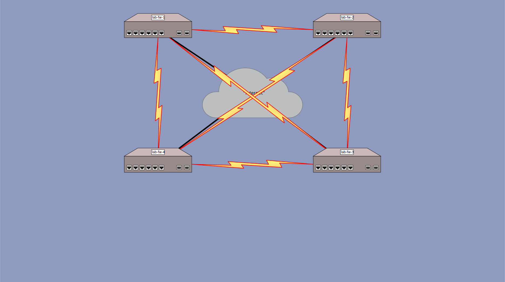

# Lab Exercise 6 - (Static) Routed IPSEC VPN

## Outcomes

When completed with this lab, you will have accomplished the following basic routing tasks:
* Replace existing static route configuration with a dynamic routing protocol (OSPF)
* Configure the OSPF protocol on all firewalls to allow bidirectional communication between customer networks
* Activate all VPN tunnels between all firewalls
* Verify the configuration
  * Observe IPSEC tunnel information on the firewall
  * Observe routing information on the firewall
  * Observe ARP information of devices connected to the firewall
  * PING and TRACEROUTE from each firewall to any/all of the private addresses


## Configuration

### Lab 6 Topology Diagram


<details><summary>lab-fw-1</summary>

### Remove Static Routes and Configure OSPF

```
{master:0}
labuser@lab-fw-1> configure
Entering configuration mode

{master:0}[edit]
labuser@lab-fw-1# delete routing-options static route 10.0.23.0/30 next-hop st0.1

{master:0}[edit]
labuser@lab-fw-1# delete routing-options static route 10.0.34.0/30 next-hop st0.1

{master:0}[edit]
labuser@lab-fw-1# delete routing-options static route 10.2.0.0/16 next-hop st0.1

{master:0}[edit]
labuser@lab-fw-1# delete routing-options static route 10.3.0.0/16 next-hop st0.1

{master:0}[edit]
labuser@lab-fw-1# delete routing-options static route 10.4.0.0/16 next-hop st0.1

{master:0}[edit]
labuser@lab-fw-1# set protocols ospf area 0.0.0.0 interface st0.0 bfd-liveness-detection minimum-interval 300 multiplier 4 full-neighbors-only

{master:0}[edit]
labuser@lab-fw-1# copy protocols ospf area 0.0.0.0 interface st0.0 to interface st0.1

{master:0}[edit]
labuser@lab-fw-1# copy protocols ospf area 0.0.0.0 interface st0.0 to interface st0.2

{master:0}[edit]
labuser@lab-fw-1# copy protocols ospf area 0.0.0.0 interface st0.0 to interface st0.3

{master:0}[edit]
labuser@lab-fw-1# set protocols ospf area 10.1.0.0 area-range 10.1.0.0/16

{master:0}[edit]
labuser@lab-fw-1# set protocols ospf area 10.1.0.0 interface lo0.0 passive

{master:0}[edit]
labuser@lab-fw-1# set protocols ospf area 10.1.0.0 interface irb.0  passive

{master:0}[edit]
labuser@lab-fw-1# commit check

{master:0}[edit]
labuser@lab-fw-1# commit
```

### Activate the Inactive tunnels and interfaces to the rest of the firewalls in the network

```
{master:0}
labuser@lab-fw-1> configure
Entering configuration mode

{master:0}[edit]
labuser@lab-fw-1# activate security ipsec vpn lab-fw-2

{master:0}[edit]
labuser@lab-fw-1# activate security ipsec vpn lab-fw-3

{master:0}[edit]
labuser@lab-fw-1# activate security ipsec vpn lab-fw-4

{master:0}[edit]
labuser@lab-fw-1# activate security zones security-zone lab-vpn interface st0.1

{master:0}[edit]
labuser@lab-fw-1# activate security zones security-zone lab-vpn interface st0.2

{master:0}[edit]
labuser@lab-fw-1# activate security zones security-zone lab-vpn interface st0.3

{master:0}[edit]
labuser@lab-fw-1# set interfaces st0.2 family inet address 10.0.13.1/30

{master:0}[edit]
labuser@lab-fw-1# set interfaces st0.3 family inet address 10.0.14.1/30

{master:0}[edit]
labuser@lab-fw-1# commit check

{master:0}[edit]
labuser@lab-fw-1# commit
```

</details>
<details><summary>lab-fw-2</summary>

### Remove Static Routes and Configure OSPF

```
{master:0}
labuser@lab-fw-2> configure
Entering configuration mode

{master:0}[edit]
labuser@lab-fw-2# delete routing-options static route 10.0.34.0/30 next-hop st0.2

{master:0}[edit]
labuser@lab-fw-2# delete routing-options static route 10.1.0.0/16 next-hop st0.0

{master:0}[edit]
labuser@lab-fw-2# delete routing-options static route 10.3.0.0/16 next-hop st0.2

{master:0}[edit]
labuser@lab-fw-2# delete routing-options static route 10.4.0.0/16 next-hop st0.2

{master:0}[edit]
labuser@lab-fw-2# set protocols ospf area 0.0.0.0 interface st0.0 bfd-liveness-detection minimum-interval 300 multiplier 4 full-neighbors-only

{master:0}[edit]
labuser@lab-fw-2# copy protocols ospf area 0.0.0.0 interface st0.0 to interface st0.1

{master:0}[edit]
labuser@lab-fw-2# copy protocols ospf area 0.0.0.0 interface st0.0 to interface st0.2

{master:0}[edit]
labuser@lab-fw-2# copy protocols ospf area 0.0.0.0 interface st0.0 to interface st0.3

{master:0}[edit]
labuser@lab-fw-2# set protocols ospf area 10.2.0.0 area-range 10.2.0.0/16

{master:0}[edit]
labuser@lab-fw-2# set protocols ospf area 10.2.0.0 interface lo0.0 passive

{master:0}[edit]
labuser@lab-fw-2# set protocols ospf area 10.2.0.0 interface irb.0  passive

{master:0}[edit]
labuser@lab-fw-2# commit check

{master:0}[edit]
labuser@lab-fw-2# commit
```

### Activate the Inactive tunnels and interfaces to the rest of the firewalls in the network

```
{master:0}
labuser@lab-fw-2> configure
Entering configuration mode

{master:0}[edit]
labuser@lab-fw-2# activate security ipsec vpn lab-fw-1

{master:0}[edit]
labuser@lab-fw-2# activate security ipsec vpn lab-fw-3

{master:0}[edit]
labuser@lab-fw-2# activate security ipsec vpn lab-fw-4

{master:0}[edit]
labuser@lab-fw-2# activate security zones security-zone lab-vpn interface st0.0

{master:0}[edit]
labuser@lab-fw-2# activate security zones security-zone lab-vpn interface st0.2

{master:0}[edit]
labuser@lab-fw-2# activate security zones security-zone lab-vpn interface st0.3

{master:0}[edit]
labuser@lab-fw-2# set interfaces st0.3 family inet address 10.0.24.1/30

{master:0}[edit]
labuser@lab-fw-2# commit check

{master:0}[edit]
labuser@lab-fw-2# commit
```

</details>
<details><summary>lab-fw-3</summary>

### Remove Static Routes and Configure OSPF

```
{master:0}
labuser@lab-fw-3> configure
Entering configuration mode

{master:0}[edit]
labuser@lab-fw-3# delete routing-options static route 10.0.12.0/30 next-hop st0.3

{master:0}[edit]
labuser@lab-fw-3# delete routing-options static route 10.1.0.0/16 next-hop st0.1

{master:0}[edit]
labuser@lab-fw-3# delete routing-options static route 10.2.0.0/16 next-hop st0.1

{master:0}[edit]
labuser@lab-fw-3# delete routing-options static route 10.4.0.0/16 next-hop st0.3

{master:0}[edit]
labuser@lab-fw-3# set protocols ospf area 0.0.0.0 interface st0.0 bfd-liveness-detection minimum-interval 300 multiplier 4 full-neighbors-only

{master:0}[edit]
labuser@lab-fw-3# copy protocols ospf area 0.0.0.0 interface st0.0 to interface st0.1

{master:0}[edit]
labuser@lab-fw-3# copy protocols ospf area 0.0.0.0 interface st0.0 to interface st0.2

{master:0}[edit]
labuser@lab-fw-3# copy protocols ospf area 0.0.0.0 interface st0.0 to interface st0.3

{master:0}[edit]
labuser@lab-fw-3# set protocols ospf area 10.3.0.0 area-range 10.3.0.0/16

{master:0}[edit]
labuser@lab-fw-3# set protocols ospf area 10.3.0.0 interface lo0.0 passive

{master:0}[edit]
labuser@lab-fw-3# set protocols ospf area 10.3.0.0 interface irb.0  passive

{master:0}[edit]
labuser@lab-fw-3# commit check

{master:0}[edit]
labuser@lab-fw-3# commit
```

### Activate the Inactive tunnels and interfaces to the rest of the firewalls in the network

```
{master:0}
labuser@lab-fw-3> configure
Entering configuration mode

{master:0}[edit]
labuser@lab-fw-3# activate security ipsec vpn lab-fw-1

{master:0}[edit]
labuser@lab-fw-3# activate security ipsec vpn lab-fw-2

{master:0}[edit]
labuser@lab-fw-3# activate security ipsec vpn lab-fw-4

{master:0}[edit]
labuser@lab-fw-3# activate security zones security-zone lab-vpn interface st0.0

{master:0}[edit]
labuser@lab-fw-3# activate security zones security-zone lab-vpn interface st0.1

{master:0}[edit]
labuser@lab-fw-3# activate security zones security-zone lab-vpn interface st0.3

{master:0}[edit]
labuser@lab-fw-3# set interfaces st0.0 family inet address 10.0.13.2/30

{master:0}[edit]
labuser@lab-fw-3# commit check

{master:0}[edit]
labuser@lab-fw-3# commit
```

</details>
<details><summary>lab-fw-4</summary>

### Remove Static Routes and Configure OSPF

```
{master:0}
labuser@lab-fw-34 configure
Entering configuration mode

{master:0}[edit]
labuser@lab-fw-4# delete routing-options static route 10.0.12.0/30 next-hop st0.2

{master:0}[edit]
labuser@lab-fw-4# delete routing-options static route 10.0.23.0/30 next-hop st0.2

{master:0}[edit]
labuser@lab-fw-4# delete routing-options static route 10.1.0.0/16 next-hop st0.2

{master:0}[edit]
labuser@lab-fw-4# delete routing-options static route 10.2.0.0/16 next-hop st0.2

{master:0}[edit]
labuser@lab-fw-4# delete routing-options static route 10.3.0.0/16 next-hop st0.2

{master:0}[edit]
labuser@lab-fw-4# set protocols ospf area 0.0.0.0 interface st0.0 bfd-liveness-detection minimum-interval 300 multiplier 4 full-neighbors-only

{master:0}[edit]
labuser@lab-fw-4# copy protocols ospf area 0.0.0.0 interface st0.0 to interface st0.1

{master:0}[edit]
labuser@lab-fw-4# copy protocols ospf area 0.0.0.0 interface st0.0 to interface st0.2

{master:0}[edit]
labuser@lab-fw-4# copy protocols ospf area 0.0.0.0 interface st0.0 to interface st0.3

{master:0}[edit]
labuser@lab-fw-4# set protocols ospf area 10.4.0.0 area-range 10.4.0.0/16

{master:0}[edit]
labuser@lab-fw-4# set protocols ospf area 10.4.0.0 interface lo0.0 passive

{master:0}[edit]
labuser@lab-fw-4# set protocols ospf area 10.4.0.0 interface irb.0  passive

{master:0}[edit]
labuser@lab-fw-4# commit check

{master:0}[edit]
labuser@lab-fw-4# commit
```

### Activate the Inactive tunnels and interfaces to the rest of the firewalls in the network

```
{master:0}
labuser@lab-fw-34 configure
Entering configuration mode

{master:0}[edit]
labuser@lab-fw-4# activate security ipsec vpn lab-fw-1

{master:0}[edit]
labuser@lab-fw-4# activate security ipsec vpn lab-fw-2

{master:0}[edit]
labuser@lab-fw-4# activate security ipsec vpn lab-fw-3

{master:0}[edit]
labuser@lab-fw-4# activate security zones security-zone lab-vpn interface st0.0

{master:0}[edit]
labuser@lab-fw-4# activate security zones security-zone lab-vpn interface st0.1

{master:0}[edit]
labuser@lab-fw-4# activate security zones security-zone lab-vpn interface st0.2

{master:0}[edit]
labuser@lab-fw-4# set interfaces st0.0 family inet address 10.0.14.2/30

{master:0}[edit]
labuser@lab-fw-4# set interfaces st0.1 family inet address 10.0.24.2/30

{master:0}[edit]
labuser@lab-fw-4# commit check

{master:0}[edit]
labuser@lab-fw-4# commit
```

</details>
